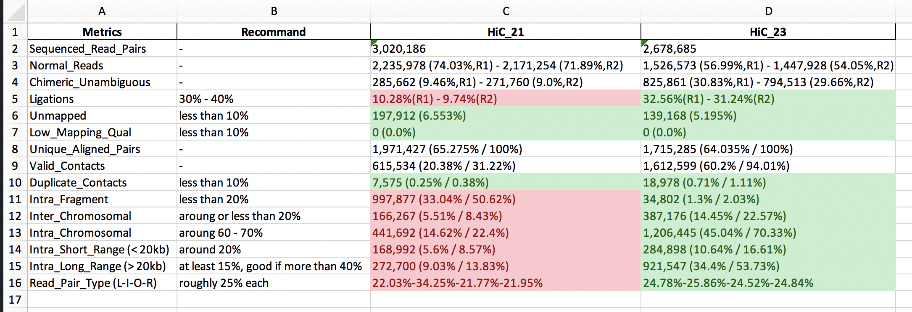
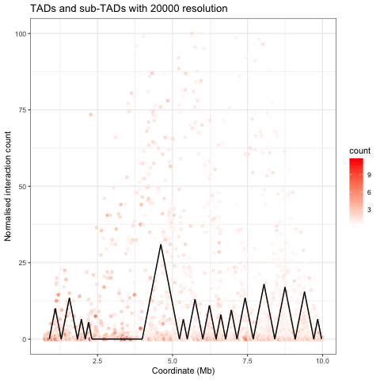

# HiC-QC

Script to Extract QC info from your HiC analysis and convert to Excel file (with colour marked) and plots.

## version 0.2.0

## Requirements

1. Python (3.x)
2. R (3.5+)
3. pandas (to install, `pip install pandas`)
4. matplotlib (to install, `pip install matplotlib`)

## What will the script do

## Input

The input of this script is the output directory of [HiC-Pro](https://github.com/nservant/HiC-Pro) pipeline.

## Output

1. A tab-delimited txt file with :

  - the first column will be all the Metrics that are extracted.
  - the second column will be the recommend stat of all the metrics ("-" indicating there is none.)
  - from the third column will be all the stat from your data.

2. distance vs. average read count plots.

  - Will plot all the resolutions that were used in your HiC-Pro analysis

3. if you set `--excel` to 1, you will also get an excel file with colour marked on the sample stat with read indicating it's bad and green indicating it's good.
  - 

4. if you set `tad` to 1, you will also get and bed file including all the TADs and a TADs plot.
  - 

## help page

```
$ python HiC-QC.py --help
usage: HiC-QC.py [-h] [--data [DATA]] [--out OUT] [--excel EXCEL]
                 [--excel_name EXCEL_NAME] [--tad TAD] [--tad_chr TAD_CHR]

HiC QC script

optional arguments:
  -h, --help            show this help message and exit
  --data [DATA]         path to the output directory of HiC-Pro pipeline
  --out OUT             The QC output forms, by default its named HiC_QC.csv
  --excel EXCEL         Set this to 1 if you want an excel output
  --excel_name EXCEL_NAME
                        The output excel file name of the QC result, by
                        default it is HiC_QC.xlsx
  --tad TAD             Set this to 1 if you want to plot TADs
  --tad_chr TAD_CHR     by default it will call tads for chr1, if you want the
                        whole genome, set this to "all", but it will take a
                        while
```
